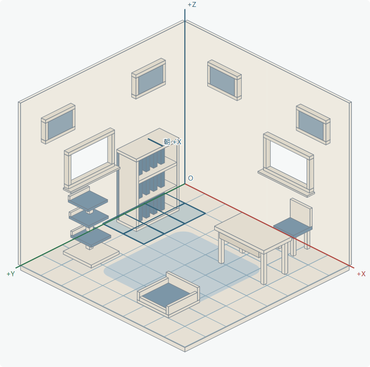

# 房间结构首轮样稿

日期：2026-10-05。对应批准方案的 A1–A3，供选择房间参数。当前为独立结构预览，不是正式家具美术，也没有接入主页、库存或存档。

## 查看

从项目根目录运行：

```powershell
python design/room-structure-2026-10-05/serve.py
```

访问 [本地结构预览](http://127.0.0.1:4181/design/room-structure-2026-10-05/)。服务器仅绑定 localhost，并明确设置 `.mjs` MIME 类型，避免 Windows 注册表导致模块无法加载。



## 已实现

- 三张参考图分别记录采样原点和比例，共用加权拟合的地面方向。可切换原图与叠线；遮挡下的原点和地板前角明确标为推算。
- 固定平行投影，无近大远小和相机拖动。原点在后侧墙脚；+X 朝右墙开口，+Y 朝左墙开口，+Z 向上。
- 墙高提供原图与 1.5 倍对比，地板宽度、物件世界尺寸、地面方向不变，房间区域增高。
- 6×6、8×8、10×10 网格对比；页面初始 8×8 只是便于查看，尚未确定正式格数。
- 书柜、书桌、椅子、猫爬架、猫窝结构实体，脚底/底座统一落在 Z=0，窗框和画框具备实体厚度。每件可切换 +X/+Y；方向切换通过实体构造完成。
- L 形三格的两个朝向示例；缺角不占格。
- 左右两个独立窗位，四个候选墙饰位，以及可以关闭显示的固定地毯。窗位为真实开口，暂不设置窗外景色；隐藏窗户后恢复完整墙面。

本轮代表家具以固定世界坐标定位，每档网格重新计算覆盖完整外缘的格子集合。后续布置阶段会改为每款预定义占格、整数格锚点、拖动吸附和确认流程，不能直接把当前示例坐标当成已完成的布置规则。

## 候选坐标参数

房间物理底面为 1×1，SVG 宽度为 1080。

```text
X_screen = 540 + 480 (x − y)
Y_screen = O_y + 239.576665 (x + y) − 588.222783 z
O_y = 62 + 316.981132 × 墙高倍率
参考墙高 = 0.538879 L
增高墙高 = 0.808319 L
```

地面边线角度约 ±26.52°；若采用对称正交、三轴统一尺度的约束，相机俯视约 29.94°。这是约束下的推导，不代表从截图唯一恢复了原游戏相机。

`calibration.json` 保存手工观测线、权重、来源尺寸和推算说明；`geometry.mjs` 使用这些数据计算上述参数，预览和测试使用同一模块。格线参考的最大方向残差约 0.17 px，三图最大约 2.33 px。采样是人工近似，残差仅验证采样线方向，不保证原画每个边缘都精确吻合。

候选挂位坐标见预览表格。地毯范围 X=0.27…0.77、Y=0.28…0.80，四角圆角半径 0.06；保持在房间内部且允许家具覆盖。原墙高不足以容纳上部四个候选画位，因此原高对比暂不显示画位。

## 验证

```powershell
node --test design/room-structure-2026-10-05/geometry.test.mjs
node design/room-structure-2026-10-05/browser.test.cjs
```

浏览器检查使用项目现有 `.tooling/browser/node_modules/playwright-core` 和隔离的 Edge 无头会话；不访问登录或用户日常浏览器资料。可通过 `ROOM_STUDY_BROWSER` 指定其他兼容浏览器路径。

- 几何测试 6 项通过：参考方向残差、投影往返、增高不缩地板、L 形连通与旋转、边界、三档网格下全部 32 种家具朝向组合的互斥占格。
- 浏览器验证 60 个网格/墙高/单件朝向状态，家具部件不超过自身水平外缘、占格无冲突；检查空房、L 形、各显示开关、原图加载、墙高切换。
- 390 px 手机宽度无页面横向溢出；全部图片/模块加载成功，无浏览器错误。

结果保存在 `verification.json`；桌面和手机截图为 `preview-desktop.png`、`preview-mobile.png`。生产 Flutter 文件和依赖均未改动，本轮不声明已完成主页集成或生产回归。

## 下一确认点

根据此样稿确认视角、墙高、6/8/10 格数、候选挂位和固定地毯范围后，进入方案阶段 B：拖动、吸附、冲突预览、确认/取消、测试库存与数量限制。正式单品的弧形与装饰随后在这个坐标系内制作。
