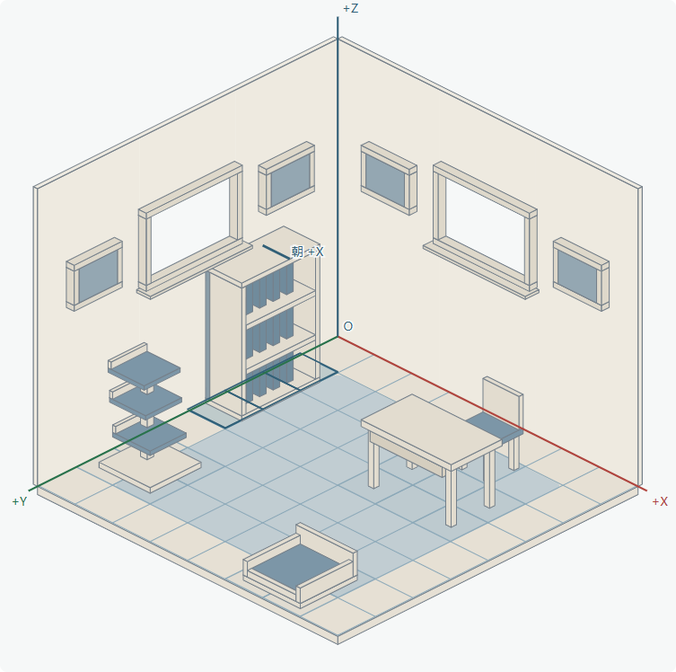

# 唯一房屋标准：room-standard-v1

以用户确认的首轮“结构与占格”图为标准。两张整屋生成图在转绘时改变了墙脚、地板及地毯比例，现已退出当前预览，不能用作房屋几何依据。它们保留为旧造型记录。

## 固定尺寸与相机

| 参数 | 固定值 |
|---|---|
| 世界底面 | 正方形 1L×1L |
| 网格 | 8×8；每格边长 L/8 |
| 墙高 | 0.8083190784267942L，即参考墙高的 1.5 倍 |
| 墙厚 / 地台厚 | 0.014L / 0.022L |
| 视图画布 | 1080×1073 |
| 地板左右内角距离 | 960 画布单位 |
| X 轴投影 | (480, 239.57666538848247) |
| Y 轴投影 | (−480, 239.57666538848247) |
| Z 轴投影 | (0, −588.2227833080509) |
| 屏幕原点 | (540, 537.4716981132076) |

这是固定平行投影；同尺寸家具在近处和远处保持同尺寸。仅随屏幕宽度对整间房等比缩放，不单独拉长墙体、缩短地板或改变房间视角。

`room-standard.mjs` 是运行时唯一几何来源，数据及向量为只读。`room-standard-v1.json` 是同值的跨工具导出，测试检查二者完全一致。参考图采样仍保留用于解释来源，但修改采样权重不会重新计算当前房屋比例。

## 五个固定基准点

| 点 | 屏幕坐标 |
|---|---|
| 后侧墙顶交点 | (540, 62) |
| 后侧墙脚原点 | (540, 537.4716981132076) |
| 地板左内角 | (60, 777.0483635016901) |
| 地板右内角 | (1020, 777.0483635016901) |
| 地板前内角 | (540, 1016.6250288901726) |

几何测试使用这些已确认数值作为回归基准。预览中更换选中物品、转向、切换空房/L 形、隐藏窗画地毯及不同屏幕宽度都检查同一相机数据。

## 本轮窗画位置

房屋本身的比例没有变化，只修改固定挂位的 Z 坐标。

- 书柜高三格，宽深和占格保持。
- 窗户沿各自墙面水平居中，宽 2.56 格、高 1.7 格，下沿从 4.15 格降低为 3.2 格。
- 窗台向下厚 0.064 格，底部高 3.136 格，所以到三格书柜顶面净距为 **0.136 格**。
- 四个画位随窗户同幅下移 0.95 格。窗画中心高均为 **4.05 格**，各画位底边高 3.55 格，左右位置保持。
- 中央 6×6 地毯、其他家具格锚点、矩形居中、两个朝向保持。

## 后续家具制作约束

**每次生成的必守协议：[FURNITURE-GENERATION.md](FURNITURE-GENERATION.md)。必须先输出数值坐标样板，并把固定投影、尺寸、朝向和接地点写入每件物品的实际生成提示词。不能仅写“等距视角”，不能只以素材位于包络内作为合格依据。需要检查实际绘制边线；禁止用估算斜率的斜切、纵向拉伸或自动接地偏移掩盖错角。**

1. 用本标准投影和单品占格模板制作家具；保留旧手稿的曲线、材质和装饰，但调整单品本身以适配模板。
2. 房屋墙面、地板与窗洞由固定几何绘制，家具使用独立素材；不再通过整屋重新生成来确定房间尺寸。
3. 第一朝向按数值样板制作，当前手板第二朝向直接逐像素镜像；完整水平外缘在声明格子内，底部锚点落在 Z=0。墙体、画作和窗景各自投影，不能镜像内容。家具细化不改变房间画布、投影或墙高。
4. 新家具的可选款式、占格与锚点属于物品数据；用户移动窗画等位置属于布局调整，都不修改本房屋标准。
5. 如果用户将来明确要求变更房屋几何，新增标准版本并重新审阅；不得默默覆盖 v1 标准或依据旧生成图重新拟合。

## 固定视觉锚点

辅助线版：[room-standard-v1.png](room-standard-v1.png)。无辅助线版：[room-standard-v1-clean.png](room-standard-v1-clean.png)。这两张来自同一个几何视图，只有网格/坐标标注的显示差异。

模板 PNG 是标准的视觉导出，数值数据为准。实时预览截图另用 `structure-preview.png`、`structure-clean.png`，避免后续修改布局时误把实时截图覆盖为标准版本。
