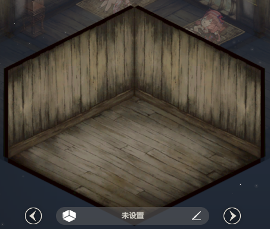
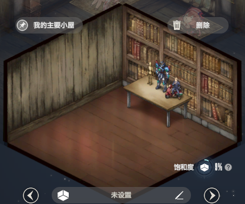
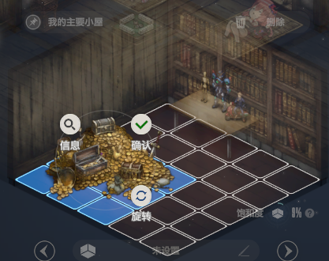

# 主页房间与布置系统：设计方案和实施计划

日期：2026-10-05。状态：阶段 A 的“结构与占格”已冻结为唯一标准 `room-standard-v1`，墙高 1.5 倍、网格 8×8。旧整屋生成图退出当前预览；窗画下移，后续单品继承固定几何。

本轮范围：房间结构、家具摆放、墙面装饰、布置操作。主页其他内容只做容纳新房间所必需的布局适配。猫咪具体美术和动效留到后续，本文保留制作路线。

## 1. 空间、陈设与编辑参考



以这张空房图作为空间基准，提取房间边线与参考墙高；正式家具风格另行确定。先建立准确坐标与结构模板，再制作单品。过去样稿的角度、家具位置、主题和像素修正值不作为本方案的几何依据。

### 补充参考：家具陈设



参考柜体靠墙、桌腿落地、厚度和正常遮挡关系。书柜与桌面的结构边线跟随各自的房间轴向，能帮助检查单品是否融入空间。截图中的桌上摆件不代表本轮新增“家具表面自由摆放”功能，当前仍按已确认的地面占格和固定墙面挂位执行。

### 补充参考：网格与选中状态



参考细线网格、选中物品占格填色、背景减淡，以及信息/确认/旋转等上下文操作的层次。网格线比木纹边缘清楚，可以作为角度与等距关系的校准证据；格子数量和格子大小只作为参考，不照搬。两种朝向和固定相机规则保持已确认定义，截图中的按钮数量或形状不自动引入额外功能。

三张截图尺寸、构图和物体遮挡不同。分别记录各自的原点与显示比例，再比较归一化方向，不直接混用像素坐标。墙高 1.5 倍仍以最初空房图为基准。

### 已确认规则

| 项目 | 规则 |
|---|---|
| 相机 | 固定，所有物体共用同一投影与尺度 |
| 墙高 | 参考图墙高的 1.5 倍；地板显示宽度保持，增加场景区域高度 |
| 地板 | 已选定 8×8 等大方格 |
| 占格 | 每款定义自己的连续格子集合，允许不规则形状；家具完整水平外缘落在声明范围内，可留白 |
| 地面家具 | 不能占用相同格子，不能超出地板；允许视觉遮挡 |
| 家具朝向 | 仅正面 +X、正面 +Y，各有对应外观 |
| 布置操作 | 拖动、网格吸附、位置预览、确认；网格仅在布置模式显示 |
| 多件家具 | 书柜、椅子可摆多件；实际数量不超过拥有数量 |
| 单件类别 | 书桌、猫窝、猫爬架暂定每类最多一件，可收藏多款供替换；上限可通过配置调整 |
| 窗户 | 左右墙各一个固定窗位，独立换款或隐藏，可同时安装 |
| 墙饰 | 多个预设挂位，每位一件，可放装饰画或其他挂墙物品 |
| 地毯 | 固定覆盖中央 6×6 格，四周留一格；可更换或隐藏；与地面家具分开计算，允许家具摆在地毯上 |
| 遮挡 | 不设置窗户、墙饰或家具的防遮挡禁放区；高家具可以挡住其他物品 |
| 猫咪 | 后续由系统安排在已布置场景中随机出现，固定外观方向，简单原地动作；玩家不摆放或旋转猫 |

以下交互细节与技术实现是本计划的建议；首轮结构稿负责把尚未确定的数值转为可审阅结果。

### 本轮样稿修订

- 1.5 倍墙高和 8×8 网格已确认，投影与地板显示宽度保持。
- 窗户在各自墙面的水平中点；书柜三格，窗宽 0.32L、高 1.7 格，下沿现降低至 3.2 格，窗台与书柜净距 0.136 格。
- 两堵墙每扇窗左右各一个画位，与窗户整体下移 0.95 格，中心均高 4.05 格；实际作品画幅规则不变。
- 地毯固定覆盖中央 6×6 格，即 X/Y 均从第 1 格边界到第 7 格边界。
- 矩形占格物品的完整水平外缘在占格矩形中居中；两种朝向都重算中心位置。示例书柜 1×3、桌子 3×2、椅子 1×1、猫爬架/猫窝 2×2，每款后续仍可独立规定占格。
- 竖直“一格”指物理高度 L/8，不直接拿屏幕上压缩后的菱形高度作为 Z 单位。

唯一几何来源及后续制作约束详见[固定标准说明](../../../design/room-structure-2026-10-05/STANDARD.md)。视图固定 1080×1073、墙高 0.8083190784267942L，投影与五个基准点不随家具变动。标准数值、跨工具导出及两张同几何模板图已保存；不再重新生成整屋来决定房屋比例。

## 2. 坐标与房间构造

### 2.1 一个世界坐标，统一负责绘制与摆放

- 原点 O：后侧两墙与地面的交点。
- +X：沿右墙，从原点朝房间开口延伸。
- +Y：沿左墙，从原点朝房间开口延伸。
- +Z：向上。
- 房间底面在世界坐标中为正方形，先用边长 L=1 的归一化单位描述；选定 A 后，每格边长为 L/A。
- 左墙位于 X=0，使用 Y/Z 定位；右墙位于 Y=0，使用 X/Z 定位。墙饰挂位有真实高度，不使用屏幕百分比定位。

统一投影表达为：

```text
screen(x,y,z) = O_screen + x·B_X + y·B_Y + z·B_Z
```

B_X、B_Y、B_Z 是世界单位轴在画面里的投影向量。房间、家具、网格、落脚点、挂位和命中检测共用这些向量。视口缩放只对整个场景执行一次。

地面点击与拖动使用同一矩阵的逆变换，还原到 X/Y，再计算格子编号。网格编号范围为 0…A−1；格子中心和边界分别定义，避免半格误差。

### 2.2 参考图校准方法

1. 标注后侧墙地交点、两侧墙地边线、墙顶边线和多条竖线。选择墙体内表面作为统一基准，单独记录外侧厚度。
2. 对多条同方向边线拟合两个地面方向，不用单条纹理线决定角度。补充编辑图中的两组重复格线用于交叉校准平行方向与等分关系；陈设图的柜顶、桌沿用于验证物体方向。图中地面线斜率初看约为 0.5 量级，只作为初估；这不是最终相机参数，也不是相机俯视角。
3. 每张参考图单独拟合原点与缩放，登记对应关系，再对照轴向。底部按钮遮住了部分地板，前角由已确定的平行边延伸求交；把直接观测点和推算点分别标明。
4. 以共同的固定平行投影拟合整间房。记录参考图描边、纹理和轻微不一致带来的残差，避免为了贴合某条噪声边线破坏其他物体的平行关系。
5. 输出参考图叠线、空房模型、坐标数据三个相互对应的结果。以叠图验证后冻结的参数为准，不预先指定一个习惯性的俯视角。

三维轴的绝对物理长度无法仅由单张截图唯一还原。首轮以正方形底面和统一尺度作为约束，确认视觉贴合后冻结高度单位；家具随后使用同一单位制作。

### 2.3 墙高、厚度与视口

- 先得到参考墙高 H_ref，再使用 H_new=1.5×H_ref；沿 Z 增高，不拉伸地板，也不重新改变地面两轴的角度。
- 墙体内表面、顶部厚度、侧面厚度来自同一个几何构造。改变高度时重新计算各面，不能把整张房屋图片纵向拉长。
- 场景缩放优先按可用地板宽度计算；新场景高度由投影后的完整边界、墙高、地台与安全边距推导。
- 主页采用有明确高度的房间区域，为更高墙面留空间。窄屏或短屏必要时使用页面纵向滚动容纳内容，房间相机仍固定；布置拖动和页面滚动分开响应。
- 固定相机方案不保留现有房间平移、双指缩放和“回到初始视角”操作。

验收：同一方向的房间边、柜顶、桌沿和窗框直边平行；等尺寸物体不会因摆在远处而缩小；墙高变化前后，地板宽度和形状一致。

## 3. 网格、款式与数量

### 3.1 每款家具定义占格集合

占格由整数格集合表示，例如 L 形三格可以是 {(0,0),(1,0),(0,1)}。第四格若不被其他家具占用，就可以摆放其他物品。连通性按共边判断，仅对角接触不算连续。

占格范围需要覆盖家具的完整水平投影，包括桌面、扶手和悬挑结构；不能只按家具腿的位置声明占格。立面随 Z 向上投影，屏幕上的家具轮廓不必被压进地板菱形内部。

不同款式可以定义不同尺寸、不同形状。同一款的两个朝向应由相同实体旋转得到，不能在两个方向里悄悄改变家具尺度。+X 转为 +Y 时，对占格进行一次 90° 变换并归一化局部锚点，同时切换对应图片与素材锚点。

切换朝向后重新检查边界与占格；发生冲突时保留预览供用户调整，不自动挪走其他家具。

### 3.2 三种独立约束

1. **购买上限**：某个款式可以拥有多少件，由商品规则决定。
2. **拥有数量**：玩家实际拥有多少件，是布置系统的数量来源。
3. **房间类别上限**：例如书桌类在房间内最多一件，虽然可以拥有多款。

放下新实例必须同时满足：剩余数量足够、类别上限允许、占格合法。换款时应在一次操作中替换旧实例，校验时排除被替换的旧实例；换款失败保留原物品和布局。

左右窗位最多各一件；某款窗户若只拥有一件，不能同时用于两个窗位。固定挂位也遵守实际拥有数量。

### 3.3 地面、墙面和地毯分开管理

- 地面家具按占格集合互斥。
- 墙面物品按挂位 ID 互斥，不占地面格子。
- 地毯使用独立固定地面位置，不占用地面家具的可用格子。
- 地毯形状和尺寸可按款式设计，但外缘应留在房间地板范围内。其固定位置与尺寸在结构稿中确认。

每个墙饰挂位给出墙面、锚点高度、允许的宽高范围与可用物品类型。挂位本身在设计时合理留间距；不因为前方地面家具遮住了挂位就禁止放置。不同宽高比的画作保留自己的画幅，不用裁切来填满挂位。

## 4. 布置体验与绘制顺序

### 4.1 正常主页

显示房间和已布置物品，不显示网格或包围框。房间角度固定。墙壁和地板仍是整体换款。

### 4.2 布置模式

建议流程：进入布置 → 从物品列表或场景选中家具 → 拖动预览 → 必要时切换 +X/+Y → 确认摆放。

- 拖动保持抓取点相对物品稳定，坐标逆变换后吸附格子。
- 预览清楚标出完整占格；冲突或越界时提供文字原因与图形标记，不只依赖颜色。
- 参考补充编辑图：空格使用细轮廓，当前物品实际占格使用填色，冲突格单独标记。对于 L 形等不规则占格，空缺格保持空白，不把整个外接矩形都涂满。
- 选中时可适度减淡其他家具与墙面，保持当前物品和网格清晰；这只是编辑态显示，不修改物品显隐、真实占格或已保存布局，退出编辑后恢复正常遮挡。
- 松手保留预览；确认才保存这次变更，取消回到原位置。保存失败仍保留待处理预览，不能显示成已经成功保存。
- 操作面板提供“切换朝向”“收起”“确认”“取消”。收起释放占格、摆放名额和可用库存，物品仍归玩家所有。
- 可借鉴截图在选中物品附近显示上下文操作；按钮应避让占格与手指拖动区域，靠屏幕边缘时调整位置，空间不足时使用底部操作条。该呈现方式在手机交互样例中验证；“切换朝向”始终只切换 +X / +Y。
- 替换大型家具不自动压缩新款来塞进旧空间；新款按自己的占格预览，允许重新摆放。
- 左右窗位、各墙饰位和地毯入口在布置面板中可以直接选取。
- 提供“已摆放物品”列表。即使家具或挂饰完全被挡住，也能从列表选中、移动、替换或收起。

### 4.3 允许遮挡，同时保证遮挡关系正确

地板 → 地毯 → 场景物体的空间遮挡，是统一绘制规则。墙面物品位于对应墙面；地面家具可以遮住它们。

地面家具按共同世界坐标、占地和实体高度判断前后关系，不按点击顺序或 PNG 文件加载顺序排列。仅按图片底边或 x+y 排序可能在高柜、L 形物品附近出错，需要代表场景验证；遇到交错遮挡的复杂单品，可为该单品分层绘制。

布置预览的轮廓提示可显示在最上层，正常展示则回到空间顺序。

## 5. 正式家具的制作规范

结构验证稿中的占位形体只用于检查方向、体积和占格，不限定最终家具只能是方块。

每款正式物品需要交付：

- 明确的款式 ID、类别、占格集合、实体高度和两个朝向。
- +X 与 +Y 外观素材、每个外观的像素锚点，以及像素到世界单位的统一比例。
- 与地面或墙面接触的校准点；必要时附有可分层绘制的前沿、背板等部件。
- 可编辑源文件或分层源、透明图片、浅深背景检查图、放进坐标模板后的预览。

先在投影模板上定轮廓、接触点和厚度，再补充曲线、软包和装饰。水平圆形按同一地面投影得到椭圆，竖向弧线按所在立面投影；弧形家具仍有统一坐标。两个朝向分别检查，不能直接把整张图片在屏幕上旋转 90°。

图像生成工具可以参与外观探索和素材制作，但生成图不自动成为准确的几何数据。每件素材都需要对齐模板检查，不能用逐件随意拉伸、切变来弥补房间与家具的角度差。

首套美术风格在结构稿确认后再决定。参考图当前用于视角与结构，不自动锁定为旧木屋主题。

## 6. 当前项目的落地方式

### 已核对的现状

| 文件 | 现状 | 计划调整 |
|---|---|---|
| assets/images/room/lunar-v5/catalog.json | 唯一固定标准、双朝向占格、图层锚点及挂位 | 后续实例布置沿用同一标准 |
| lib/features/room/room_scene.dart | 仅使用固定标准原生渲染，支持平移缩放 | 后续布置操作沿用当前视口与相机 |
| lib/features/room/room_furniture.dart | 每类一个款式、显隐、墙地样式；本机按用户保存 | 拆清款式定义、实例位置、挂位配置与数量约束 |
| lib/features/room/furniture_store.dart | 选款和显隐自动保存，无完整的家具购买数量模型 | 先提供已拥有数量及可摆数量接口；后续商店设计再接真实购买流程 |
| lib/features/home/home_page.dart | 房间铺满 Stack，绑定拖动视口和双指缩放 | 按地板宽度计算房间区域高度；接入布置模式与固定相机 |

现有相关测试：room_standard_test.dart、lunar_room_test.dart、room_furniture_test.dart、home_scene_test.dart。旧房屋坐标、素材、备用渲染、样稿及本地备份已删除；原生接入详情见 NATIVE-LUNAR.md。

### 最小数据分工

| 数据 | 内容 |
|---|---|
| 房间几何 | 基向量、原点、房间边长、参考墙高、新墙高、厚度、A |
| 款式目录 | 款式与类别、购买上限、占格与高度、朝向素材及锚点、允许挂位类型 |
| 拥有清单 | 款式对应的实际数量；来源与房间布局分开 |
| 摆放实例 | 独立实例 ID、款式 ID、格子锚点、+X/+Y 朝向 |
| 固定位置配置 | 左右窗位、墙饰位、地毯对应的款式或空值 |
| 房间存档 | 版本号、网格/几何版本、实例列表和固定位置配置，保持按用户隔离 |

布局规则、命中检测与图像绘制使用同一坐标模块。数量与类别上限使用同一校验入口，避免商店、拖动和恢复存档各自判断出不同结果。

结构与交互验证可以使用明确标注的测试库存，不发生真实扣款。真实商品购买、定价、交易与云端库存另属后续商店设计；本轮定义好接入边界。旧选款记录不能直接视为购买记录或据此认定已经拥有所有可选款式。

存档升级先保留旧记录。新格式校验通过后写入新的版本键；旧款式只有存在明确的新目录与权益映射时才迁移为新实例。无法映射的记录保留并可回退，不能丢弃后默默用另一款替代。

## 7. 猫咪后续动效路线

### 工具选择

项目已依赖 Flutter 与 Flame 1.38.2。优先用现有运行环境承担房间渲染、布局交互和后续猫咪动画，不因简单呼吸和摇尾另引入动画工具。

Flame 的组件可以组织分层外观，效果系统可以驱动缩放或角度，帧动画可播放多个姿势帧。[组件文档](https://docs.flame-engine.org/latest/flame/components/components.html)、[效果文档](https://docs.flame-engine.org/latest/flame/effects/effects.html)、[图片与动画文档](https://docs.flame-engine.org/latest/flame/rendering/images.html)。实施时核对项目锁定版本的具体 API。

Rive 提供骨骼和动画编辑能力及 Flutter 运行支持，可作为以后需要人工时间轴编辑或更复杂变形时的备选；当前不作为必要依赖。[Rive 官方功能](https://rive.app/features)。

### 由 ChatGPT 执行的后续流程

1. 检查已有猫咪属性图能否直接使用，包括分辨率、姿态、背景、可分层程度；角色设定图不自动等于可播放素材。
2. 选择一个固定姿态，准备身体、尾巴及必要的前后遮挡层；保持花纹、体型和五官一致，补齐运动时可能露出的区域。
3. 先制作一个呼吸循环：以稳定的落点为基准让躯干小幅起伏，避免整只猫上下漂移。再制作一个尾巴循环：确定尾根支点，必要时分段或使用少量关键帧表现弯曲，而不是让整条尾巴像硬板一样摆动。
4. 用代码控制周期、停顿与少量节奏变化，检查循环接缝；若某个动作更适合逐帧制作，再输出相同画布、相同锚点的短帧序列。
5. 在支持猫咪出现的家具或场景位置定义停留点，记录位置、高度、允许姿态和前景遮挡层。系统只在当前可用停留点中选择，不随机塞进任意格子。
6. 猫与停留点一起绑定到家具实例；家具移动、收起或切换朝向时重新验证停留点。编辑期间暂停相关随机变化。没有可用位置时暂不显示，不生成悬空或穿插画面。
7. 验证视觉一致性、循环自然度、各停留点遮挡、屏幕适配与运行开销；交付分层源、动画素材、参数和接入代码。

后续再确认猫咪数量、停留时长、切换时机及具体动作，当前不把这些未确定数值写死。

## 8. 分阶段实施计划

表中路径为预计修改范围，新增文件名称实施时按项目约定整理。每一步先做可检查的小交付，再进入依赖它的下一步。

### 阶段 A：可审阅的结构样例

| 任务 | 交付与验收 | 验证方式 | 依赖 / 范围 |
|---|---|---|---|
| A1 参考图校准 | 标注空房图、格线图与陈设图；分别拟合显示原点/比例，给出共同方向与可重复投影参数；区分观测点与推算点 | 三图叠线交叉检查；投影/逆投影一致；平行线和格线间距检查 | 无；独立设计目录 2–3 个文件 |
| A2 高墙与网格对比 | 同一个房间展示原墙高与 1.5 倍墙高；暂用 6×6、8×8、10×10 对比格数 | 同宽截图比较；手机尺寸检查；地板宽度和相机保持一致 | A1；结构预览与参数文件，1–2 个文件 |
| A3 摆放模板 | 放入书柜、桌椅、猫窝等代表占位，含 L 形占格及两个朝向；展示两个窗位、多处墙饰候选位和地毯候选范围 | 坐标/占格标注；完整地板边界检查；立面线与地面线校对 | A2；结构预览与参数文件，1–2 个文件 |

**确认点 A：** 用户查看后确定投影视觉、A 的值、房间尺度、墙饰位数量及位置、地毯固定位置和尺寸范围。6/8/10 是候选比较值，不是已选方案，也不由截图格数直接推定。网格比较时保持世界尺度和代表家具的外观尺度一致，重新显示各档网格下覆盖实际外缘所需的占格，避免同时缩放家具而误导选择。重点比较较粗格子的触摸便利与较细格子的摆放自由度，再决定是否需要额外密度。

### 阶段 B：布置规则的可操作验证

| 任务 | 交付与验收 | 验证方式 | 依赖 / 范围 |
|---|---|---|---|
| B1 单件摆放闭环 | 一个测试家具可选择、拖动、吸附、确认与取消；仅两个朝向；占格高亮与操作按钮清楚可用 | 触摸/鼠标实际操作；边界、逆投影、旋转锚点测试；小屏按钮不遮住落位信息 | 确认点 A；坐标模块、编辑控制与小型测试，3–4 个文件 |
| B2 多实例与限制 | 测试库存支持多把椅子、多书柜；两款书桌仍只能摆一张；支持不规则占格 | L 形空缺格可放物品；占格冲突、越界、库存不足、换款失败保留原状 | B1；目录/实例模型、校验与测试，3–4 个文件 |
| B3 固定位置与遮挡 | 左右窗位独立，墙饰一位一件，地毯不能拖动；被挡物品可通过列表选中 | 双窗、隐藏/替换、地毯下摆家具、高柜遮窗和恢复选择 | B2；场景、挂位面板、相关测试，3–4 个文件 |

**确认点 B：** 在手机宽度下完成一次实际布置；无需准确点中被遮挡的小物件也能操作。此阶段仍可使用占位美术和测试库存。

### 阶段 C：现有项目接入与存档

| 任务 | 交付与验收 | 验证方式 | 依赖 / 范围 |
|---|---|---|---|
| C1 布局保存 | 新布局按用户保存；失败可重试；升级保留旧配置，数量来源与布局分离 | 重启恢复、用户隔离、损坏记录处理、保存失败与旧数据映射测试 | B3；存储适配、模型、测试，3–4 个文件 |
| C2 主页接入 | 固定相机，房间按地板宽度布局；高墙完整可见；现有房外入口可使用 | 手机/窄屏/短屏；布置拖动不触发相机平移；必要滚动与按钮可达性 | C1；home_page、room_scene、视口测试，3–4 个文件 |
| C3 目录和库存边界 | 选款、库存余量和类别上限共用同一规则；测试库存与正式数量来源清晰区分 | 库存变化后重新校验；换款不复制实例；旧选择不被误当购买数据 | C1；目录/数量适配、商店入口与测试，3–4 个文件 |

**确认点 C：** 真实购买流程尚未实现时，只声明布置及测试库存闭环完成。正式库存/购买能力由后续商店任务提供，不能把测试数量作为生产权益。

### 阶段 D：按模板制作正式家具

| 任务 | 交付与验收 | 验证方式 | 依赖 / 范围 |
|---|---|---|---|
| D1 单品样板 | 先选一件含弧线、厚度和接触点的家具，制作 +X/+Y 两个方向，形成素材规范 | 两方向在多个格子上显示；脚底不漂浮；直边平行；弧形和装饰保留 | 确认点 A、用户选定首套风格；单品素材与定义，约 3–5 项产物 |
| D2 逐件扩充 | 沿用样板逐件制作家具、左右窗户、墙饰、墙地和地毯；每件独立换款/收起 | 每完成单件就检查占格、锚点、遮挡和浅深背景边缘，再接下一件 | D1；按单品小批次交付，不一次重做整套 |
| D3 场景验收 | 正式素材接入完整布置流程，完成各种占格和朝向组合检查 | Flutter analyze、相关测试、主页关键流程回归、手机实机或模拟器查看 | C2/C3、D2；按发现的问题定点修改 |

**确认点 D：** 风格、比例、占格与交互均通过后，才进入后续发布/合并/安装流程。猫咪另开后续制作阶段，按第 7 节执行。

## 9. 必测情形

- 同一家具在近处和远处尺度一致；地面拾取投影往返稳定，边界格没有半格偏移。
- L 形占格旋转后形状正确，空缺格仍可用，完整外缘不伸入未声明的格子。
- 不规则占格高亮对应真实集合；背景减淡不改变实际摆放状态；切换朝向与确认按钮在屏幕边缘仍可操作。
- 不同款书桌同时摆放被类别上限拒绝；两把已拥有椅子可以独立移动和保存。
- 两窗独立配置；一件窗户库存不能复用成两件；墙饰一位一件且维持画幅。
- 地毯不可拖动，但其上可摆家具；地面家具遮住窗画仍可确认，且被挡物品可从列表找回。
- 移动时不把自己旧占格当成冲突；切换朝向或换款失败不吞掉原家具。
- 保存失败、退出未确认预览、恢复旧记录都不会产生重复实例或静默丢失配置。
- 高柜、低桌、椅子和不规则家具组合的前后顺序正确，不能仅靠一个图片底边排序凑效果。

## 10. 首轮明确交付与后续待定项

下一步的首轮交付应是：**原图坐标叠线、1.5 倍墙高的空房、三档网格对比、代表家具占位、左右窗位/墙饰位/固定地毯位置示例**。

通过该样例确定 A、精确基向量、视口高度、挂位数量与坐标、固定地毯位置及尺寸。正式美术主题、商品购买规则细节和猫咪动作资源后续分别确认。

阶段 A 已交付[独立结构样稿](../../../design/room-structure-2026-10-05/README.md)，包含三图叠线、原高/1.5 倍墙高、6/8/10 格对比、五类实体占位、两个朝向、L 形占格、两个独立窗位、四个候选挂位和固定地毯。

首轮比较验证完成后，用户选定 8×8 网格与 1.5 倍墙高，并认可中央 6×6 地毯、居中高窗及家具居中。最新修订把书柜降为三格，窗户宽/高增加约 14%/13%，保持两侧画位与窗中心等高。

曾根据旧月轨手稿生成两版整屋效果图，但其房屋比例偏移，现已退出预览，[记录仅作历史](../../../design/room-structure-2026-10-05/STYLE.md)。后续使用固定房屋几何与独立家具素材，旧图只提供单品造型参考。

最新几何测试 9 项、浏览器 10 个家具朝向状态及所有显示模式检查通过，标准相机与五个角点保持不变；360/390 px 手机等比适配通过。8×8 下全部 32 种朝向组合仍验证互斥占格与外缘覆盖。阶段 B/C 的拖动、库存、存档和主页集成尚未实施。
